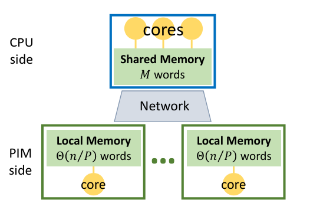

# The Processing-in-Memory Model

 

## Key components of the model
* CPU-side: Parallel cores with fast access to a small shared memory.
* PIM-side: Multiple PIM modules, each with a core and a local memory of size Θ(n/P) for an input of size n.
* Network: Connects the CPU-side and PIM-side, enabling communication between them.

## Challenges of the Model
* Load balancing: ensure that the workload is evenly distributed across all processing units.
* Communication Efficiency: Minimizes the communication time between different processing units.

## Model's Novelty
* Unlike traditional models, the PIM model uniquely combines shared and distributed memory aspects, enabling the design of efficient parallel algorithms.
* It addresses the limitations of previous approaches by ensuring that data accesses are mostly local, thus significantly reducing data movement costs.

## Data Structures
The paper [Concurrent Data Structures with Near-Data-Processing: an Architecture-Aware Implementation](https://jiwon-choe.github.io/spaa19-choe.pdf) perform evaluation on the folloowng data structures 
* SKIP LIST : Paper [The Processing-in-Memory Model ](https://www.cs.ucr.edu/~ygu/papers/SPAA21/PIM.pdf) presented an efficient skip list for the model, supporting a wide range of batch-operations from point operations to range operations 
* FIFO
* LINKED LIST
